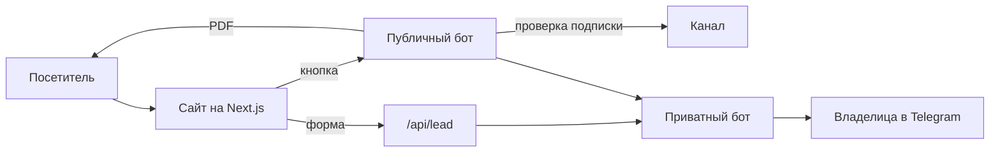

# гречка · сайт-воронка для SMM-агентства

**Сайт → заявка или Telegram-бот → уведомление владельцу в Telegram.**
Сайт для SMM-специалистки, которая ведёт соцсети бизнесу с длинным циклом сделки: недвижимость, образование, услуги.

🔗 **Сайт:** https://grechka-omega.vercel.app

> Код проекта приватный (клиентский). Здесь — что сделано и как устроено.
> *Client project — source code is private. This page shows what was built and how.*

## Задача

Собрать из разрозненных постов и кейсов в Telegram-канале сайт, который продаёт услуги и приводит заявки, а не просто «визитку».

## Что сделано

- **Дизайн и анимации.** Своя дизайн-система без UI-библиотек: печатающийся заголовок, появление блоков по скроллу, закреплённая сцена «Знакомо?», смена фона между секциями, шторки при переходах, плавный скролл.
- **32 кейса** с задачей, решением, цифрами, фото и видео (видео пережаты с 102 до 74 МБ).
- **Форма заявки → Telegram.** Серверная функция принимает заявку, защищена ловушкой для ботов и ограничением частоты, сохраняет источник (UTM, откуда пришёл человек).
- **Два Telegram-бота.** Публичный проверяет подписку на канал и отдаёт PDF-чек-лист; приватный присылает владелице заявки и события.
- **Блог** на Markdown с автоимпортом постов из канала и обложками с номером выпуска.
- **SEO.** Заголовки и описания под запросы, JSON-LD (Organization, Service, FAQ, Article, Breadcrumbs), sitemap, robots, canonical.
- **Юридическое.** Политика ПДн, согласие, реквизиты ИП, пометки Meta* по законам РФ.
- **Страница менторства** — вторая воронка для тех, кто сам идёт в SMM.

| Кейсы | Страница кейса | Телефон |
|---|---|---|
|  |  |  |

## Как устроено

## Стек

Next.js 16 (App Router) · React 19 · TypeScript · CSS-переменные · GSAP (ScrollTrigger, SplitText) · Lenis · Telegram Bot API · Vercel · Playwright (тесты, скриншоты, PDF) · ffmpeg

---

Сделал [lightisagod](https://github.com/lightisagod) · [Telegram](https://t.me/derevo1337sol)
