# гречка · сайт-воронка для SMM-агентства

**Сайт → заявка или Telegram-бот → уведомление владельцу в Telegram.**
Сайт для SMM-специалистки, которая ведёт соцсети бизнесу с длинным циклом сделки: недвижимость, образование, услуги.

🔗 **Живой сайт:** https://grechka-omega.vercel.app

> Клиентский проект, код приватный. Здесь — что сделано и как устроено.
> *Client project — source code is private. This page shows what was built and how.*

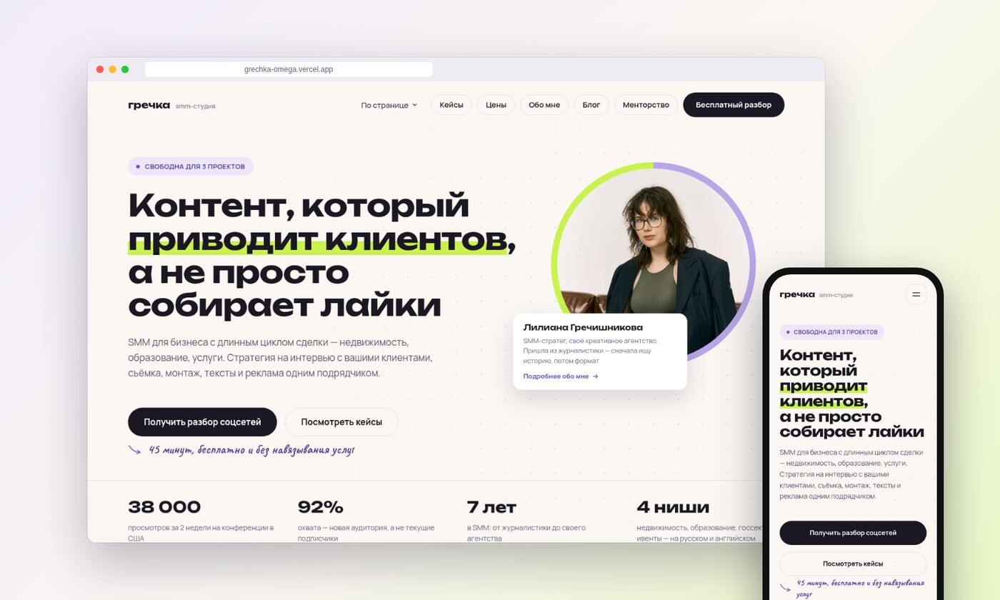

## Анимации

Всё на GSAP и ScrollTrigger, без готовых шаблонов: прелоадер, печатающийся заголовок с маркером, бегущие ленты, закреплённая сцена «Знакомо?» с летящими карточками, смена фона между секциями, кейсы стопкой, шторки при переходах между страницами, плавный скролл (Lenis). Анимируются только `transform` и `opacity` — 60 fps без фризов.

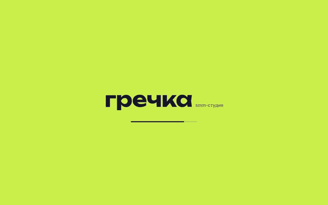

## Что сделано

| | |
|---|---|
| 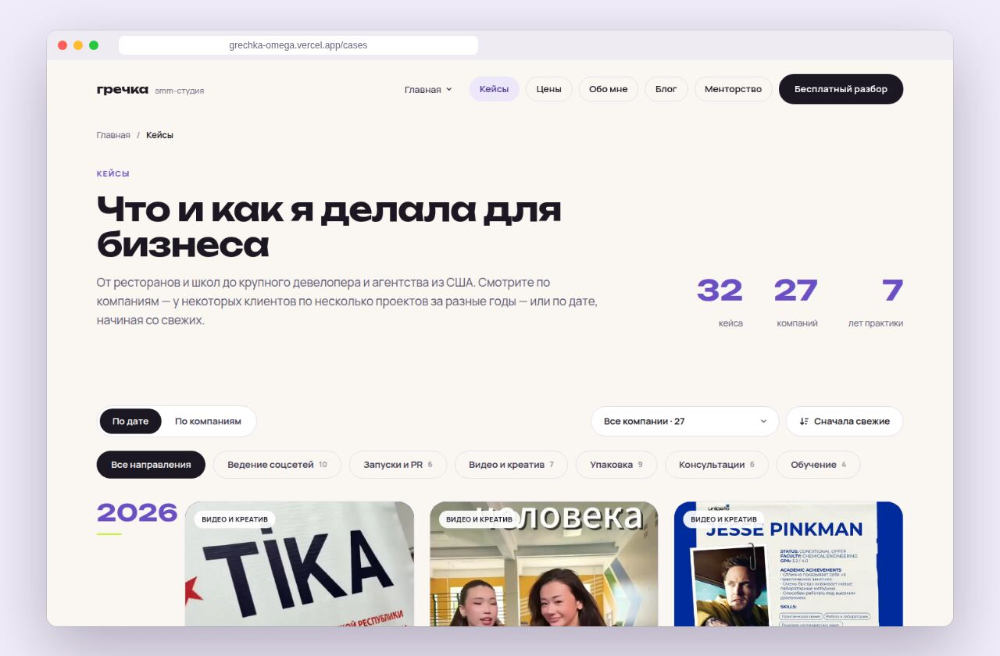 | **32 кейса** с фильтрами по направлениям и компаниям. У каждого — задача, решение, цифры, фото и видео (видео пережаты с 102 до 74 МБ). |
| 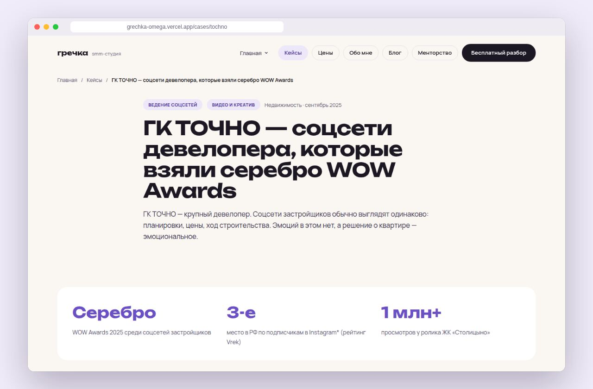 | **Страница кейса** — крупные цифры, галерея, разметка для поисковиков (Article, Breadcrumbs). |
| 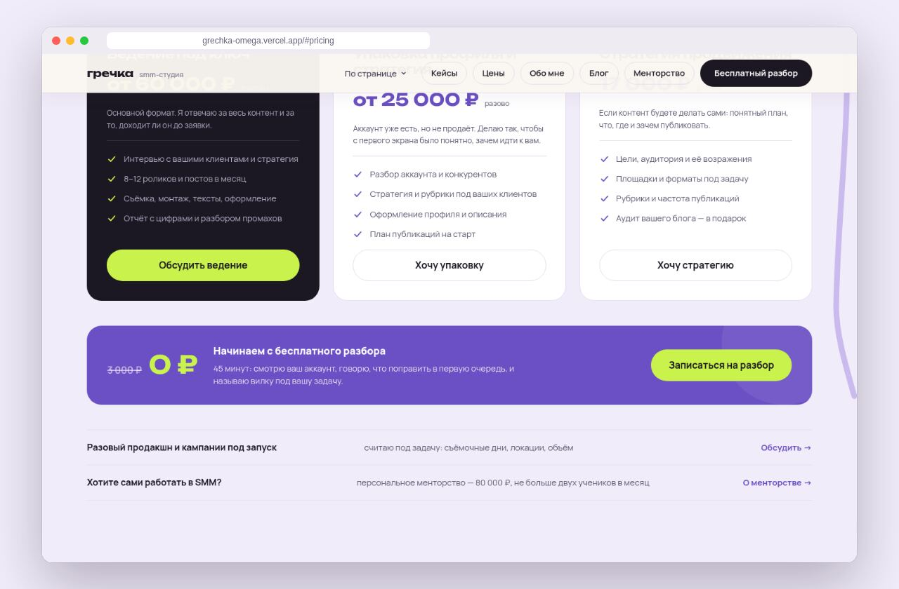 | **Цены** — три формата и полоса «бесплатный разбор: 3 000 → 0 ₽», которая ведёт к форме. |
| 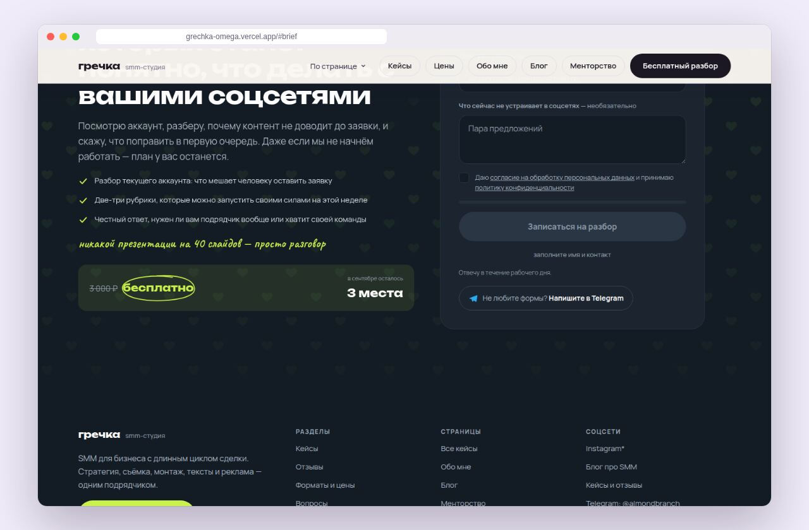 | **Форма → Telegram.** Серверная функция шлёт заявку владелице, сохраняет источник (UTM, откуда пришёл человек), защищена ловушкой для ботов и лимитом. Рядом — «Написать в Telegram» с готовым текстом. |
| 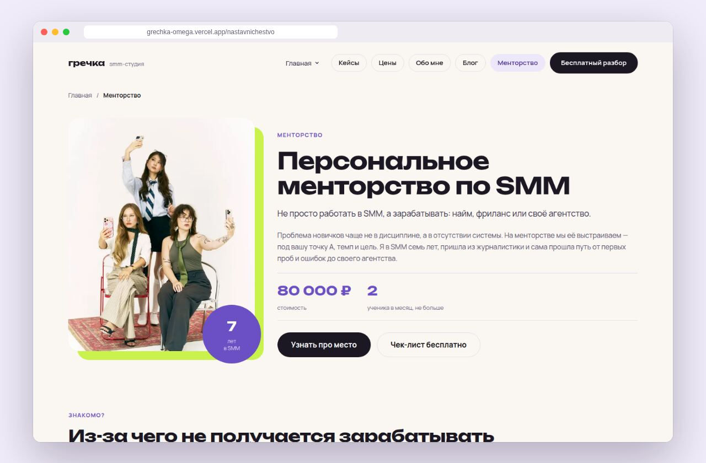 | **Вторая воронка — менторство**: отдельная страница для тех, кто сам идёт в SMM, и Telegram-бот, который проверяет подписку на канал и отдаёт PDF-чек-лист. |
| 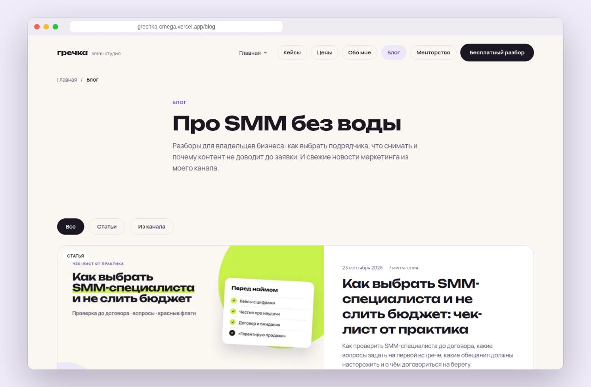 | **Блог** на Markdown с автоимпортом постов из Telegram-канала и обложками-выпусками. |
| 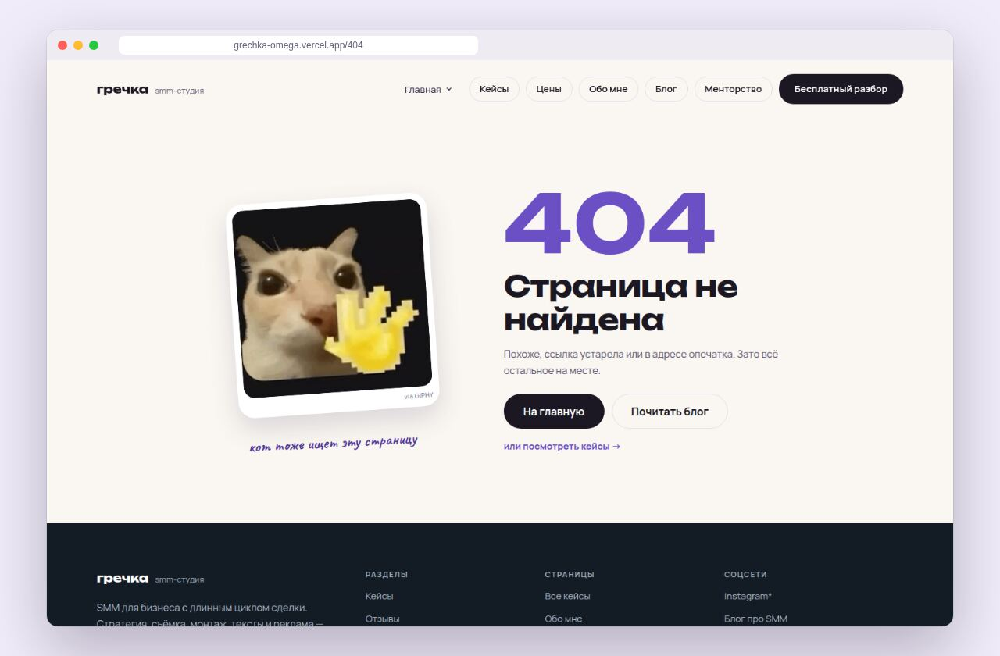 | **404** с котом и дорогой обратно в воронку. |

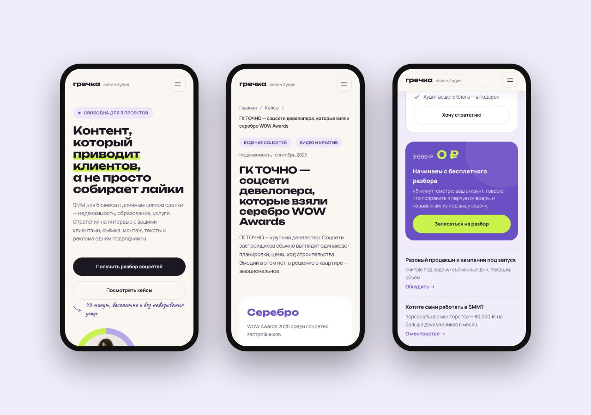

## Как устроено

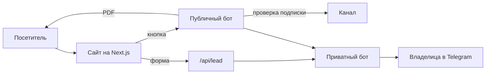

**SEO:** заголовки и описания под запросы, JSON-LD (Organization, Service, FAQ, Article, Breadcrumbs), sitemap, robots, canonical, закрытие тестового адреса от индексации.
**Юридическое:** политика ПДн, согласие, реквизиты ИП, пометки Meta* по законам РФ.

## Стек

Next.js 16 (App Router) · React 19 · TypeScript · CSS-переменные без UI-библиотек · GSAP (ScrollTrigger, SplitText) · Lenis · Telegram Bot API · Vercel · Playwright (тесты, скриншоты, PDF) · ffmpeg

---

Сделал [lightisagod](https://github.com/lightisagod) · [Telegram](https://t.me/derevo1337sol)
